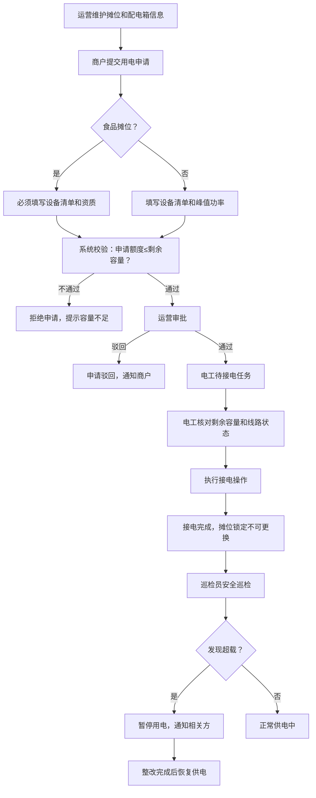
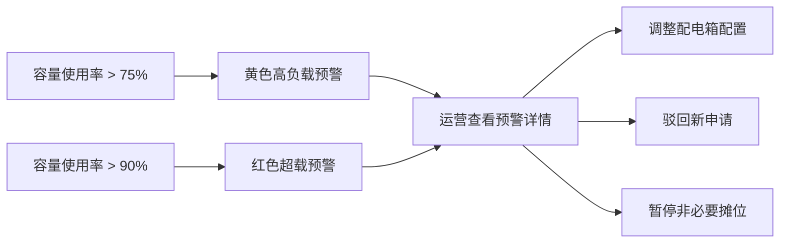

## 1. 产品概述

露天市集摊位用电管理系统是一个面向市集运营的协同决策平台，围绕配电容量统一调度，让运营、电工、商户和安全巡检员四类角色在同一工作流中协同作业，解决市集临时用电申请、审批、接电、巡检和容量预警全流程管理问题。

- 核心目标：实现摊位配电容量的透明化、精细化管理，降低用电安全风险
- 目标用户：运营管理员、电工、商户、安全巡检员

## 2. 核心功能

### 2.1 用户角色

| 角色 | 说明 | 核心权限 |
|------|------|----------|
| 运营管理员 | 市集运营方人员 | 维护摊位/配电箱信息、调整配电箱配置、审批用电申请、查看容量预警、处理摊位调整 |
| 电工 | 负责现场接电的技术人员 | 核对剩余容量、执行接电操作、记录接电信息、查看线路状态 |
| 商户 | 市集摊位经营者 | 提交用电申请、填写设备清单、撤回申请、查看申请状态 |
| 安全巡检员 | 用电安全检查人员 | 执行安全巡检、记录异常、发现超载后暂停用电、恢复供电 |

### 2.2 功能模块

1. **摊位配电总览页**：摊位平面图、配电箱容量占用状态、容量预警面板
2. **运营工作台**：摊位/配电箱维护、用电申请审批、容量预警处理
3. **商户用电申请页**：用电申请表单、设备清单录入、申请历史、撤回操作
4. **电工接电台**：待接电任务、容量核对、接电记录、线路状态
5. **安全巡检台**：巡检任务、异常记录、超载暂停、恢复供电
6. **容量监控中心**：实时容量占用、预警列表、历史趋势

### 2.3 页面详情

| 页面名称 | 模块名称 | 功能描述 |
|---------|---------|---------|
| 摊位配电总览 | 摊位平面图 | 可视化展示摊位布局、配电连接关系、用电状态（空闲/申请中/已接电/异常） |
| 摊位配电总览 | 容量状态卡片 | 各配电箱额定容量、已用容量、剩余容量、使用率百分比、预警标识 |
| 摊位配电总览 | 容量预警面板 | 超载预警、临期活动提醒、异常状态汇总 |
| 运营工作台 | 摊位维护 | 新增/编辑摊位：摊位编号、名称、位置、所属配电箱、额定容量、临时活动时段、相邻摊位限制、已占用额度 |
| 运营工作台 | 配电箱维护 | 新增/编辑配电箱：编号、位置、额定容量、关联摊位、线路状态 |
| 运营工作台 | 申请审批列表 | 待审批申请、审批操作（通过/驳回）、审批意见、容量占用预检查 |
| 运营工作台 | 配电箱调整 | 调整配电箱容量分配、摊位-配电箱重关联、记录调整原因 |
| 商户用电申请 | 申请表单 | 选择摊位、填写峰值功率、设备清单、活动时段、用电需求说明 |
| 商户用电申请 | 食品摊位资质 | 食品经营许可证上传/编号、设备清单强制填写 |
| 商户用电申请 | 申请历史 | 我的申请列表、状态查看、撤回未审批申请 |
| 电工接电台 | 待接电任务 | 已通过待接电列表、摊位信息、申请额度 |
| 电工接电台 | 容量核对 | 剩余容量校验、线路状态检查、安全检查结果确认 |
| 电工接电台 | 接电操作 | 接电完成确认、接电时间记录、接电人员签字（文本）、接电备注 |
| 电工接电台 | 接电记录 | 历史接电列表、接电详情、摊位锁定状态（接电后不可更换） |
| 安全巡检台 | 巡检任务 | 待巡检摊位列表、巡检项清单 |
| 安全巡检台 | 异常记录 | 超载检测、线路异常、设备违规、拍照/备注记录 |
| 安全巡检台 | 暂停用电 | 发现超载后执行暂停、记录原因、通知运营和商户 |
| 安全巡检台 | 恢复供电 | 异常整改后恢复、检查确认、恢复记录 |
| 容量监控中心 | 实时容量占用 | 所有配电箱容量使用率仪表盘、排行 |
| 容量监控中心 | 预警列表 | 超载预警（>90%）、高负载预警（>75%）、活动时段冲突 |
| 容量监控中心 | 历史趋势 | 容量使用趋势图、峰值时段分析 |

## 3. 核心流程

### 3.1 用电申请审批接电流程

运营先维护好摊位和配电箱基础信息 → 商户提交用电申请（食品摊位必须填设备清单）→ 系统校验申请额度是否超过剩余容量 → 运营审批（通过/驳回）→ 电工接电前核对容量和线路状态 → 电工执行接电并记录 → 摊位锁定不可更换 → 巡检员巡检发现超载可暂停用电 → 整改后恢复。

### 3.2 容量预警与调整流程

## 4. 用户界面设计

### 4.1 设计风格

- **主色调**：工业安全色系 - 深蓝色主色（#1e3a5f 配电专业感）+ 琥珀色辅助（#f59e0b 预警色）+ 翠绿色（#10b981 安全正常色）+ 朱砂红（#ef4444 危险警报色）
- **按钮风格**：直角微圆角（4px），实线边框，按压态有明显下沉效果
- **字体**：中文使用思源黑体（Noto Sans SC），数字使用等宽字体（JetBrains Mono）强调容量数值的可读性
- **布局风格**：顶部全局导航 + 左侧角色切换 + 主内容卡片式布局，数据面板采用仪表盘风格
- **图标风格**：Lucide线性图标，关键状态点使用彩色图标徽章

### 4.2 页面设计概览

| 页面名称 | 模块名称 | UI元素 |
|---------|---------|--------|
| 摊位配电总览 | 摊位平面图 | 网格布局摊位卡片，悬停显示详情，不同状态用颜色边框区分，连接线表示配电箱-摊位关联 |
| 摊位配电总览 | 容量状态卡片 | 渐变进度条显示使用率，百分比大号数字，超载时背景闪烁动画 |
| 摊位配电总览 | 容量预警面板 | 时间线样式展示预警列表，严重程度用色标区分，点击跳转处理 |
| 运营工作台 | 表单区 | 左右两列表单，容量相关字段带单位后缀，相邻摊位多选 |
| 商户用电申请 | 设备清单 | 动态增删行表格，设备名称/数量/单台功率/总功率自动计算合计 |
| 电工接电台 | 容量核对 | 三栏对比：额定容量 - 已占用 - 申请额度 = 校验结果，绿/红背景色 |
| 容量监控中心 | 仪表盘 | SVG环形进度图，中心显示百分比，外圈颜色随阈值变化 |

### 4.3 响应式设计

- **桌面端优先**（≥1280px）：多列并排布局，仪表盘全展开
- **平板端**（768px-1279px）：两列自适应，图表自动缩放
- **移动端**（<768px）：单列堆叠，关键信息卡片优先展示，表格横向滚动

### 4.4 交互动效

- 摊位状态变更：颜色渐变过渡 + 轻微放大反馈
- 容量预警：脉冲动画（pulse）提示
- 提交审批：按钮loading态 + 成功/失败toast通知
- 页面切换：淡入淡出 + 内容从下轻微上移
