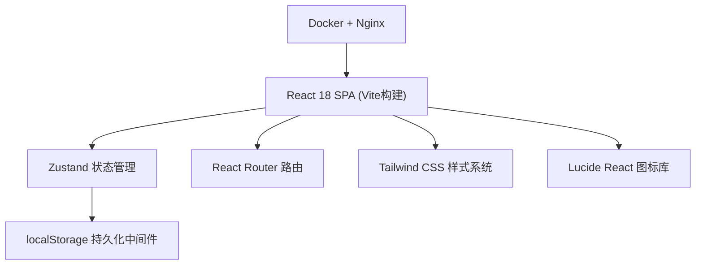
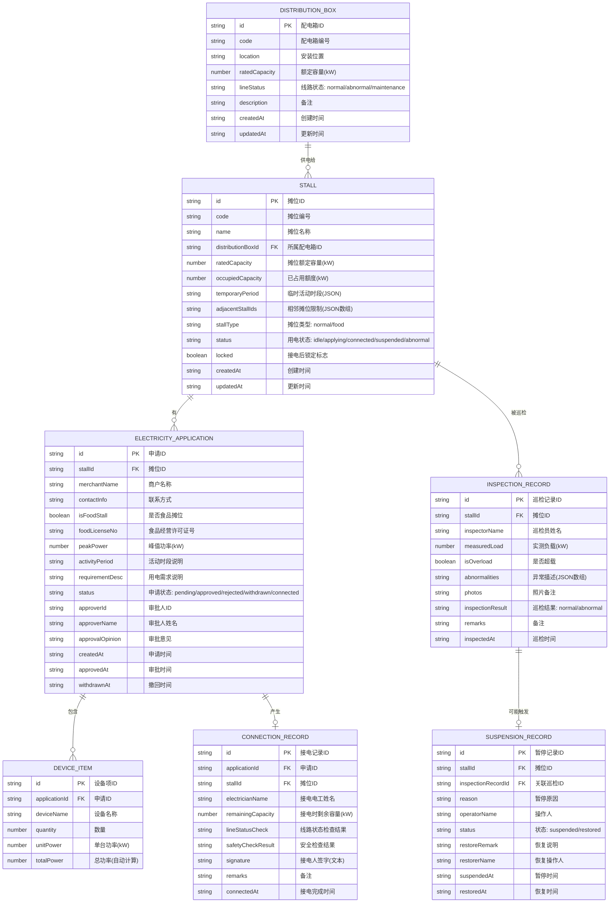

## 1. 架构设计

纯前端单页应用（SPA），数据持久化采用浏览器 localStorage 本地存储，支持 Docker 容器化 Nginx 静态资源部署。



## 2. 技术描述

- **前端框架**：React 18 + TypeScript 5
- **构建工具**：Vite 5
- **路由管理**：react-router-dom 6
- **状态管理**：zustand 4（配合 persist 中间件实现 localStorage 持久化）
- **样式方案**：Tailwind CSS 3
- **图标库**：lucide-react
- **后端**：无（纯前端，数据本地存储）
- **数据库**：localStorage（浏览器本地）
- **容器化**：Docker + Nginx (Alpine)
- **包管理器**：pnpm（优先）或 npm

## 3. 路由定义

| 路由路径 | 页面组件 | 角色可见性 | 用途说明 |
|---------|---------|-----------|---------|
| `/` | Dashboard | 所有角色 | 摊位配电总览（默认首页） |
| `/operation` | OperationWorkbench | 运营管理员 | 运营工作台：摊位/配电箱维护、审批申请 |
| `/merchant` | MerchantApplication | 商户 | 商户用电申请：提交申请、管理我的申请 |
| `/electrician` | ElectricianStation | 电工 | 电工接电台：待接电任务、接电操作、接电记录 |
| `/inspection` | InspectionStation | 安全巡检员 | 安全巡检台：巡检任务、异常记录、暂停/恢复用电 |
| `/capacity` | CapacityMonitor | 所有角色（管理员全功能） | 容量监控中心：仪表盘、预警列表、历史趋势 |

## 4. 数据模型

### 4.1 实体关系图



### 4.2 容量计算规则

- 配电箱已占用容量 = Σ(关联摊位的已占用额度)
- 摊位已占用额度 = 该摊位当前生效申请的峰值功率
- 剩余容量 = 额定容量 - 已占用容量
- 高负载预警阈值：使用率 > 75%
- 超载预警阈值：使用率 > 90%
- 申请提交校验：申请峰值功率 ≤ 剩余容量

### 4.3 状态流转规则

**摊位状态 (Stall.status)**
- `idle`（空闲） → 商户提交申请 → `applying`（申请中）
- `applying` → 运营审批通过 → 等待电工接电（保持applying）
- `applying` → 电工接电完成 → `connected`（已接电）+ `locked=true`
- `applying` → 运营驳回 / 商户撤回 → `idle`（空闲）
- `connected` → 巡检发现超载暂停 → `suspended`（暂停）
- `suspended` → 恢复供电 → `connected`

**申请状态 (Application.status)**
- `pending`（待审批）→ 运营审批 → `approved`（已通过）/ `rejected`（已驳回）
- `pending` → 商户撤回 → `withdrawn`（已撤回）
- `approved` → 电工接电完成 → `connected`（已接电）

## 5. 核心业务校验逻辑

| 校验场景 | 校验规则 | 错误提示 |
|---------|---------|---------|
| 提交用电申请 | 食品摊位必须至少填写1条设备清单 | "食品摊位请填写设备清单后再提交" |
| 提交用电申请 | 申请峰值功率 ≤ 配电箱剩余容量 | "申请额度超过剩余容量，请调整功率或联系运营" |
| 提交用电申请 | 摊位状态必须为idle | "该摊位当前不可申请，请选择其他摊位" |
| 接电操作 | 剩余容量再次校验 ≥ 申请峰值功率 | "剩余容量不足，无法接电" |
| 接电操作 | 线路状态必须为normal | "线路状态异常，请先处理线路问题" |
| 接电操作 | 安全检查结果必须通过 | "安全检查未通过，无法接电" |
| 摊位更换/删除 | locked=true时禁止操作 | "该摊位已完成接电，不可更换或删除" |
| 撤回申请 | 仅pending状态允许撤回 | "当前状态不可撤回申请" |
| 暂停用电 | 仅connected状态允许暂停 | "仅已接电摊位可执行暂停操作" |

## 6. 目录结构设计

```
src/
├── components/          # 可复用组件
│   ├── layout/          # 布局组件（Header、Sidebar、RoleSwitcher）
│   ├── stall/           # 摊位相关组件（StallCard、StallGrid、StallForm）
│   ├── capacity/        # 容量相关组件（CapacityCard、GaugeChart、WarningList）
│   ├── form/            # 表单组件（DeviceList、TimeRangePicker）
│   └── common/          # 通用组件（Modal、Toast、StatusBadge）
├── pages/               # 页面组件
│   ├── Dashboard.tsx
│   ├── OperationWorkbench.tsx
│   ├── MerchantApplication.tsx
│   ├── ElectricianStation.tsx
│   ├── InspectionStation.tsx
│   └── CapacityMonitor.tsx
├── store/               # Zustand状态管理
│   ├── useAuthStore.ts      # 角色/用户模拟
│   ├── useStallStore.ts     # 摊位数据
│   ├── useBoxStore.ts       # 配电箱数据
│   ├── useApplicationStore.ts # 申请数据
│   ├── useConnectionStore.ts # 接电记录
│   ├── useInspectionStore.ts # 巡检记录
│   └── useWarningStore.ts    # 预警数据（计算派生）
├── types/               # TypeScript类型定义
│   ├── index.ts         # 实体类型
│   └── enums.ts         # 枚举常量
├── utils/               # 工具函数
│   ├── capacity.ts      # 容量计算
│   ├── validation.ts    # 校验规则
│   ├── id.ts            # ID生成
│   └── time.ts          # 时间处理
├── data/                # Mock初始数据
│   └── seed.ts          # 种子数据
├── hooks/               # 自定义Hooks
│   └── useCurrentRole.ts
├── router/              # 路由配置
│   └── index.tsx
├── App.tsx
├── main.tsx
└── index.css
```

## 7. Docker 部署配置

- 基础镜像：`nginx:alpine`
- 构建阶段：`node:20-alpine` 执行 `pnpm build`
- 发布阶段：将 `dist/` 目录复制到 `/usr/share/nginx/html`
- 暴露端口：`80`
- Nginx 配置：支持 History 路由模式的 fallback
